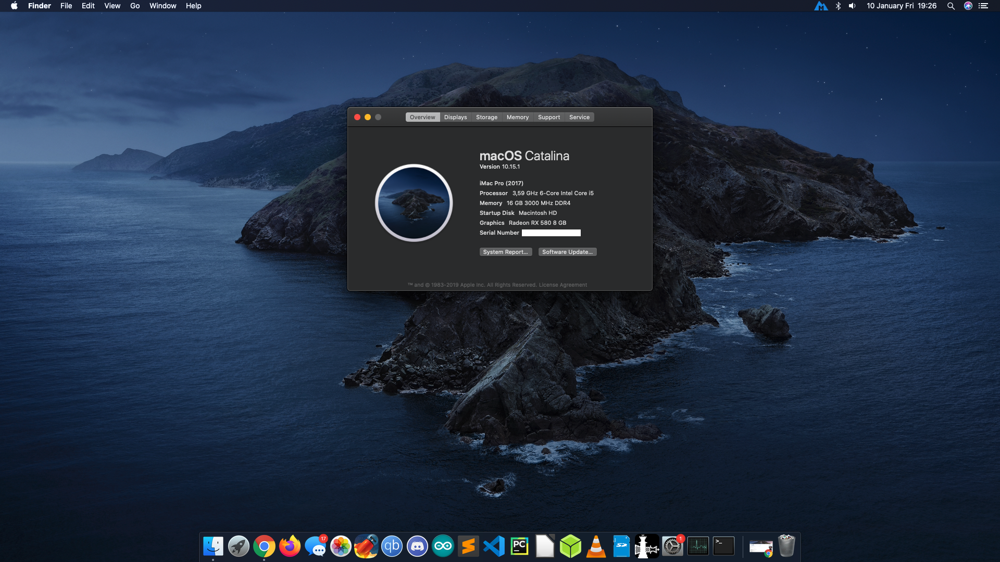
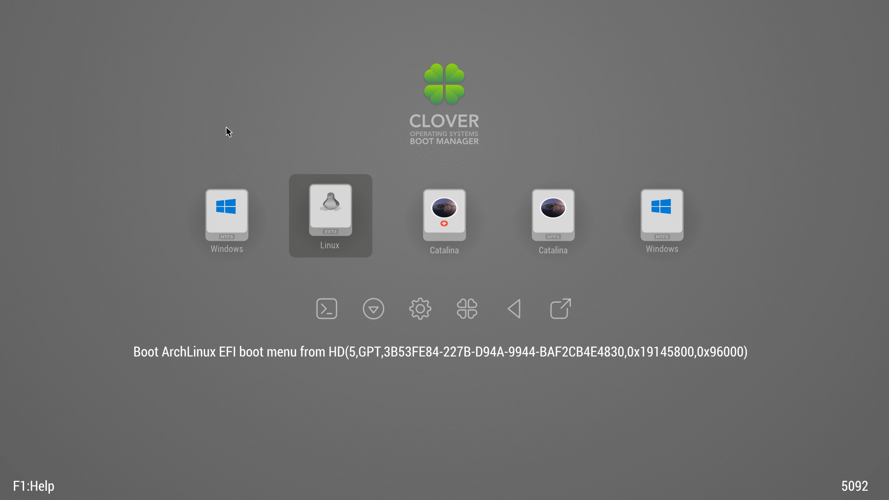

# b450m-s2h-hackintosh
Gigabyte B450M-S2H hackintosh (mac OS Catalina 10.15.1)

What's working: **Everything even sleep!** (sound, ethernet, gpu	acceleration, hdmi sound, 3.5mm audio ports etc.)

What's not working: Seems like nothing for now.

# complete build
- Mainboard: Gigabyte B450M S2H Micro ATX AM4 w/ F50 BIOS (AMD AGESA 1.0.0.4 B)

- CPU: AMD Ryzen 5 3600 3.6 GHz 6-Core Processor

- GPU: Sapphire Radeon RX 580 Pulse OC 8 GB (11265-05-20G)

- Memory: 2pcs * Crucial Ballistix Sport LT 8 GB (1 x 8 GB) DDR4-3000 (BLS8G4D30AESBK)

- Storage: Samsung 860 Evo 250 GB 2.5" for mac OS

- Storage: Samsung 850 Evo 120 GB 2.5" for Arch Linux

- Storage: Samsung 860 Evo 500 GB 2.5" for Windows 10

- Storage: WD HDD for shared storage

- Case: Cooler Master RC 690 ATX Mid Tower

- Power Supply: Gigabyte G750H 750 Watt 80+ Gold Certified Semi-modular ATX Power Supply
#

**Thanks to all the developers who made this possible. And of course thanks to all hackintosh community.**

https://amd-osx.com/ & https://github.com/AMD-OSX/AMD_Vanilla
